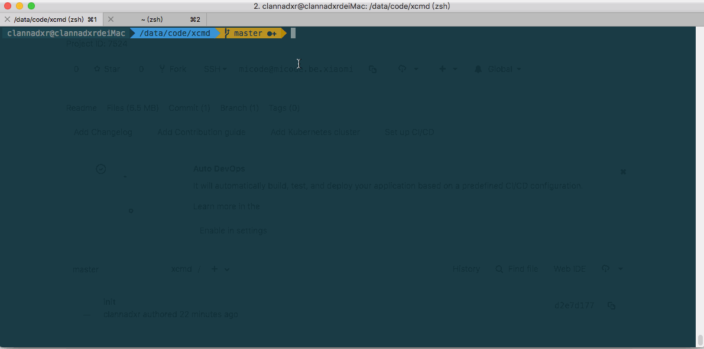

## xcmd

并发执行脚本

```sh
./bin/xcmd --command="php -f ./phpscripts/echo.php command test --siteID={{.}}" --parameters="1,2,3,4"

```

[demo.gif](./resources/demo.gif)




### features

* 依据模板变量，执行多脚本 --command="executable command --siteID={{.}}" --parameters="1,2,3,4"
* 可选并发、顺序执行: --concurrent=true/false
* 超时关闭: --contextDeadline=60 (60s后关闭子进程)
* 最大并发数: --maxProcess=10 为防止并发进程过多导致内存过高触发OOM，可配置最大并发数
* 僵尸进程检测: --outputCheckDeadline=30 (30s内无任何输出，包括stdout和stderr，将会被kill掉)
* 定时向std输出文本，防止主进程被当成无输出脚本关闭: --knockInterval=2
* 顺序输出所有脚本的标准输出
* 优雅退出，收到系统退出指令后，终端子进程并输出子进程的std后再退出主进程

### TODO
* 将子进程设置为一个进程组，采用syscall来杀死进程组